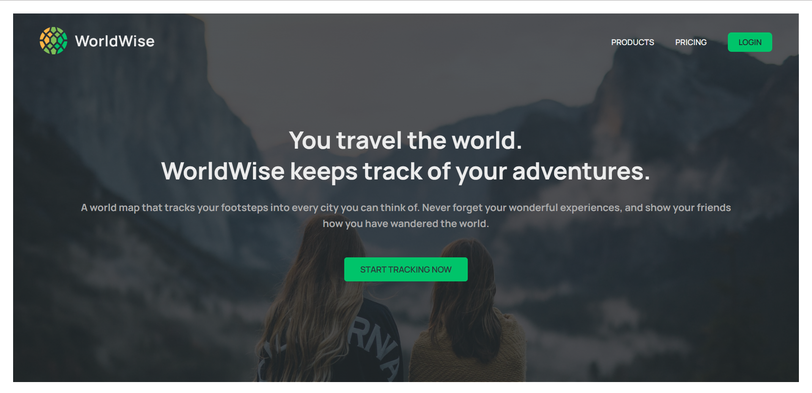
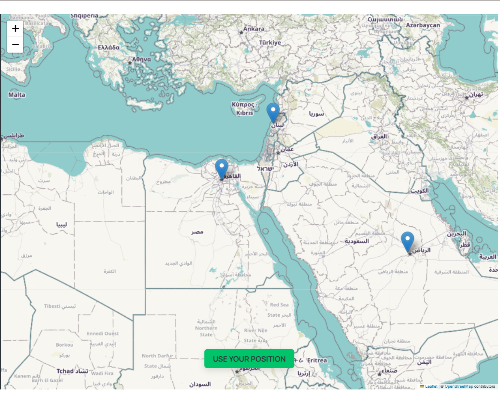
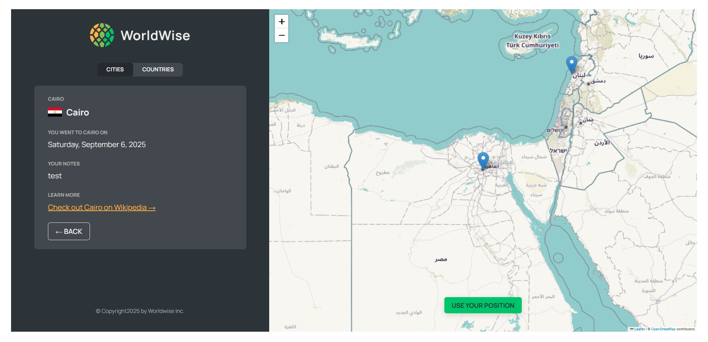
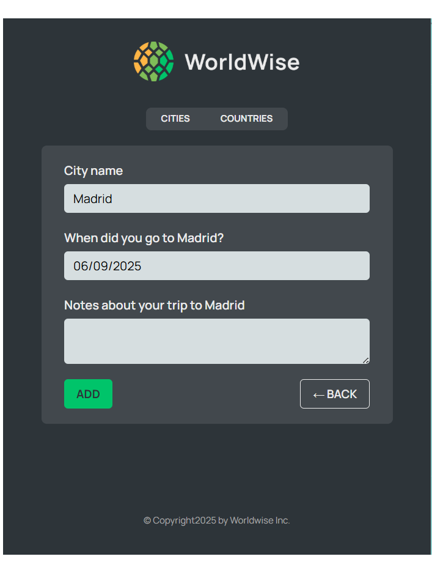
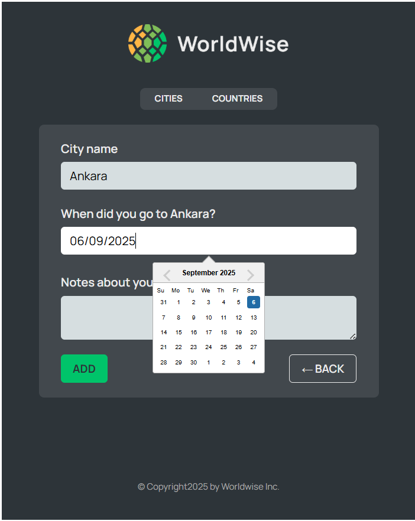
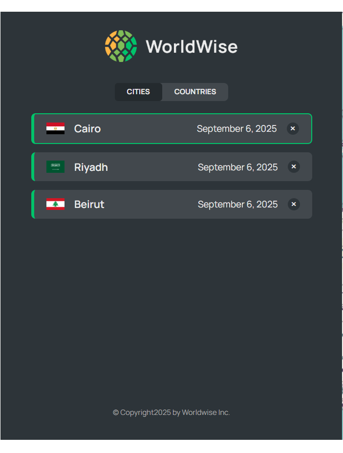
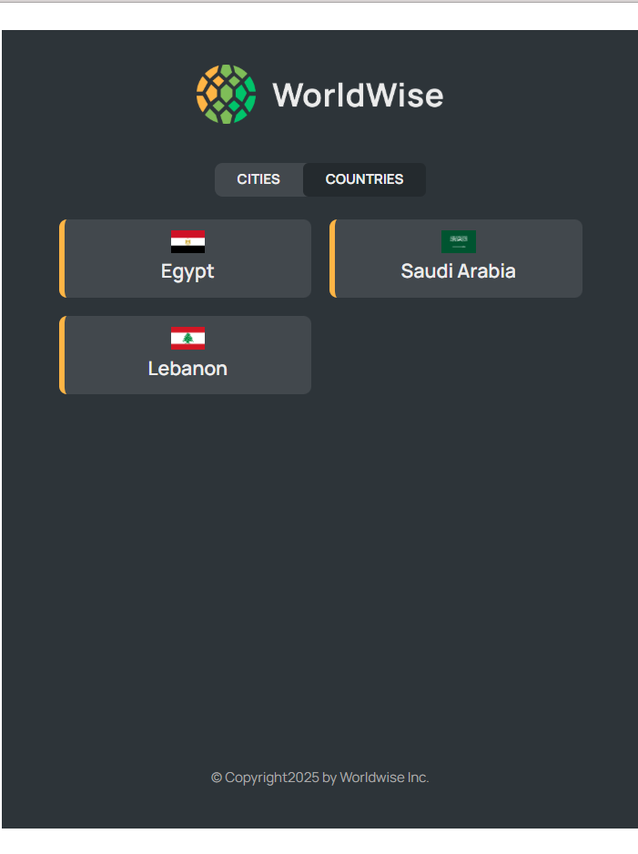

# WorldWise 🌍

A modern React application for tracking your travels and creating a personal map of all the cities you've visited around the world.

## 🔗 Live Demo

**[View Live Application →](https://world-wise-eight-sooty.vercel.app/)**

## Features ✨

- **Interactive Map**: Click anywhere on the map to add a new city to your travel log
- **City Management**: Add, view, and delete cities from your travel history
- **Country Overview**: View all countries you've visited with their flags
- **Geolocation**: Use your current location to center the map
- **Travel Notes**: Add personal notes and dates for each city visit
- **Persistent Storage**: Your travel data is saved locally and persists between sessions
- **Responsive Design**: Works seamlessly across desktop and mobile devices

## 📸 Screenshots

### Homepage


_Clean and modern landing page with call-to-action_

### Interactive Map View


_Interactive map showing all visited cities with markers_

### City Details


_Detailed view of a specific city with notes and visit information_

### Add New City Form




### Cities List



### Countries Overview



## Tech Stack 🛠️

- **Vite** - Fast build tool and development server
- **React 18** - Modern React with hooks and functional components
- **React Router** - Client-side routing for navigation
- **Leaflet & React-Leaflet** - Interactive maps and markers
- **React DatePicker** - Date selection for travel dates
- **Context API with useReducer** - Advanced state management for cities data
- **CSS Modules** - Scoped styling
- **Local Storage** - Data persistence

## Getting Started 🚀

### Prerequisites

- Node.js (version 16 or higher)
- npm or yarn package manager

### Installation

1. **Clone the repository**

   ```bash
   git clone <repository-url>
   cd worldwise
   ```

2. **Install dependencies**

   ```bash
   npm install
   ```

3. **Start the development server**

   ```bash
   npm run dev
   ```

4. **Open your browser**
   Navigate to `http://localhost:5173`

### Available Scripts

- `npm run dev` - Start development server
- `npm run build` - Build for production
- `npm run preview` - Preview production build locally
- `npm run lint` - Run ESLint (if configured)

### Required Dependencies

```json
{
  "vite": "^4.x",
  "@vitejs/plugin-react": "^4.x",
  "react": "^18.x",
  "react-dom": "^18.x",
  "react-router-dom": "^6.x",
  "react-leaflet": "^4.x",
  "leaflet": "^1.x",
  "react-datepicker": "^4.x"
}
```

## How to Use 📖

### Adding a New City

1. Navigate to the app section
2. Click anywhere on the map where you want to add a city
3. Fill out the form with:
   - City name (auto-populated based on coordinates)
   - Date of visit
   - Personal notes about your trip
4. Click "Add" to save the city

### Viewing Your Cities

- **Cities Tab**: View all cities you've visited in a list format
- **Countries Tab**: See all countries you've visited with their flags
- Click on any city to view detailed information

### Navigation

- Use the map to explore different regions
- Click the "Use your position" button to center the map on your current location
- Use the sidebar navigation to switch between cities and countries views

## API Integration 🌐

The app integrates with:

- **BigDataCloud Reverse Geocoding API**: Converts coordinates to city/country names
- **FlagCDN**: Displays country flags
- **OpenStreetMap**: Provides map tiles through Leaflet

## Data Storage 💾

- All travel data is stored locally in your browser using `localStorage`
- Data persists between browser sessions
- No server-side storage required

## State Management Architecture 🏗️

The app uses React's Context API combined with `useReducer` for robust state management:

### CitiesContext with useReducer

- **Centralized State**: All cities data, loading states, and current city managed in one place
- **Predictable Updates**: State changes handled through dispatched actions
- **Actions Available**:
  - `loading` - Sets loading state
  - `cities/loaded` - Loads cities from localStorage
  - `city/loaded` - Sets current city
  - `cities/created` - Adds new city
  - `cities/deleted` - Removes city from list

### Benefits of useReducer Pattern

- **Complex State Logic**: Better handling of multiple state updates
- **Debugging**: Clear action types make state changes traceable
- **Scalability**: Easy to add new actions and state properties
- **Testing**: Reducer functions are pure and easily testable

## Custom Hooks 🎣

### `useGeolocation`

- Manages browser geolocation functionality
- Returns current position, loading state, and error handling

### `useUrlPosition`

- Extracts latitude and longitude from URL search parameters
- Enables deep linking to specific map locations

---

Happy travels! 🧳✈️
